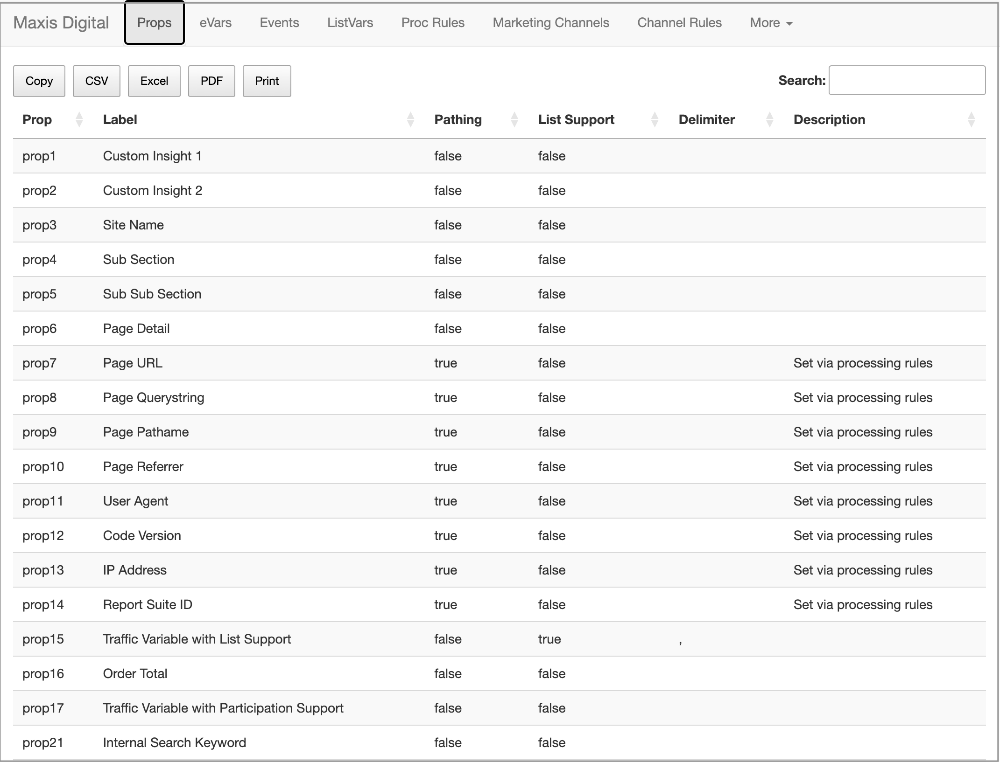

# R Shiny SDR
 Adobe Solution Design Reference site built using R Shiny and RSiteCatalyst

## Requires

 Expects the following packages installed:

### Definitely

* [shiny](https://github.com/rstudio/shiny)
* [shinyBS](https://ebailey78.github.io/shinyBS/)
* [DT](https://rstudio.github.io/DT/)
* [RSiteCatalyst](https://randyzwitch.com/rsitecatalyst/)
* [DataCache](https://github.com/jbryer/DataCache)

### Maybe

* [ggplot2](https://ggplot2.tidyverse.org/)
* [readxl](https://readxl.tidyverse.org/)
* [dplyr](https://dplyr.tidyverse.org/)

## Authentication

This Shiny app relies on [RSiteCatalyst for authentication](https://marketing.adobe.com/developer/documentation/authentication-1/using-web-service-credentials-2) with Adobe's Analytics API.

> Legacy (WSSE)
The ‘legacy’ method of authenticating with the Adobe Analytics API requires knowing your User Name and Shared Secret, which can be obtained from the same User Management -> Users -> Access menu in the Admin panel where Web Services Access is granted.

## Configuration

`.Renviron` contains the following settings

* **APP_TITLE** Name to put in the top left corner. eg, Company Name
* **AW_REPORTSUITE_ID** The report suite id
* **AW_USERNAME** Your WSSE username
* **AW_SECRET** Your WSSE secret
